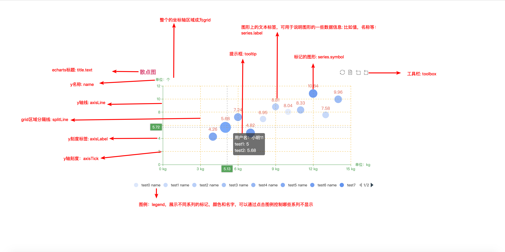

## `echarts`入门篇

### 构建实例

### `echarts`基本组件概念
一个直角坐标系中`echarts`有如下一些基础组件：  
* `title`: 标题组件，包含主标题和副标题
* `tooltip`: 提示框
* `grid`: 直角系内绘图网格
* `xAxis/yAxis`: 直角坐标系grid中的x轴(y轴类似)
* `legend`: 图例组件。展现了不同系列的标记(`symbol`)，颜色和名字。可以通过点击图例控制哪些系列不显示
* `toolbox`: 工具栏
* `legend`: 图例
* `series`: 系列列表。每个系列通过`type`决定自己的图表类型

这里我将常用的一些属性以图形的方式进行了一个简单整理，方便记忆：  

### 第一个`echarts`图表

预览地址: https://wangkaiwd.github.io/echarts-study/demo/demo01.html

这里我根据官方的一个最简单的`demo`进行了一些扩展，并为对应的配置项都添加了相应的注释，方便阅读.

代码如下：  
```html
<body>
  <div id="demo01" style="width:800px;height:400px">

  </div>
  <script>
    const myChart = echarts.init(document.getElementById('demo01'))
    const data = [
      //维度x, 维度y, 其它维度
      [10.0, 8.04, '小明1'],
      [8.0, 6.95, '小明2'],
      [13.0, 7.58, '小明3'],
      [9.0, 8.81, '小明4'],
      [11.0, 8.33, '小明5'],
      [14.0, 9.96, '小明6'],
      [6.0, 7.24, '小明7'],
      [4.0, 4.26, '小明8'],
      [12.0, 10.84, '小明9'],
      [7.0, 4.82, '小明10'],
      [5.0, 5.68, '小明11']
    ]
    const option = {
      legend: { // 图例
        type: 'scroll',
        // data: [1, 2, 3]
        bottom: '0'
      },
      title: { // 标题组件，包含主标题和副标题
        text: '散点图',
        padding: [5, 24],
        // subtext: '单位：个', // 副标题
        // itemGap: 20, // 主副标题之间的间距  gap: n. 缺口；分歧；间隔
        textStyle: {
          color: '#ec407a'
        }
      },
      tooltip: { // tooltip: 提示框
        trigger: 'item',
        axisPointer: { // 坐标轴指示器配置项：鼠标移入展示元素时鼠标样式
          type: 'cross'
        },
        formatter: function (params) { // 通过formatter来自定义提示框文字
          return `
            <div>用户名：${params.data[2]}</div>
            <div>test1: ${params.data[0]}</div>
            <div>test2: ${params.data[1]}</div>
          `
        }
      },
      toolbox: { // 工具栏
        right: '2%',
        feature: { // 各工具配置项
          saveAsImage: { // 保存为图片

          },
          restore: { // 配置项还原

          },
          dataView: { // 数据视图工具

          },
        },
      },
      grid: { // 直角系内绘图网格，单个grid内最多可以放置上下俩个x轴和左右俩个y轴
        // top: '18%', // 绘图网格距离容器顶部的距离，默认： '60'（单位不写默认为px）
        // left: '10%', // 绘图网格距离容器左侧的距离，默认： '20%'
        containLabel: true
      },
      xAxis: {
        name: '单位：kg',
        axisLine: { // 坐标轴轴线
          lineStyle: {
            color: '#34a853'
          }
        },
        axisTick: { // 坐标轴刻度相关设置 （这里的刻度自己理解错了）
          show: true
        },
        splitLine: { // 坐标轴在grid区域中的分割线
          lineStyle: {
            color: '#fbbc05',
            type: 'dashed'
          }
        },
        axisLabel: { // 刻度标签
          formatter: '{value} kg' // 刻度标签的内容格式器：刻度显示的内容（可以通过字符串模板和函数进行自定义）
        }
      },
      yAxis: {
        name: '单位：个',
        axisLine: {
          lineStyle: {
            color: '#34a853'
          }
        },
        axisTick: {
          show: true
        },
        splitLine: {
          lineStyle: {
            color: '#fbbc05',
            type: 'dashed'
          }
        }
      },

    };
    const series = data.map((item, i) => {
      return {
        label: { // 标记上的文本标签
          show: true,
          position: 'top',
          distance: '4',
          color: '#ea4334',
          fontSize: 14
        },
        data: [item], // 展示数据
        itemStyle: {
          color: `rgba(66,133,244,${(i + 2) / 10})`
        },
        name: `test${i} name`, // 系列名称，用于tooltip的显示，legend的图例筛选
        symbolSize: 20 + i, // 标记的图形大小， symbol: 象征；标志；符号；记号
        type: 'scatter', // 散点图
      }
    })
    option.series = series
    myChart.setOption(option)
  </script>
</body>
```

